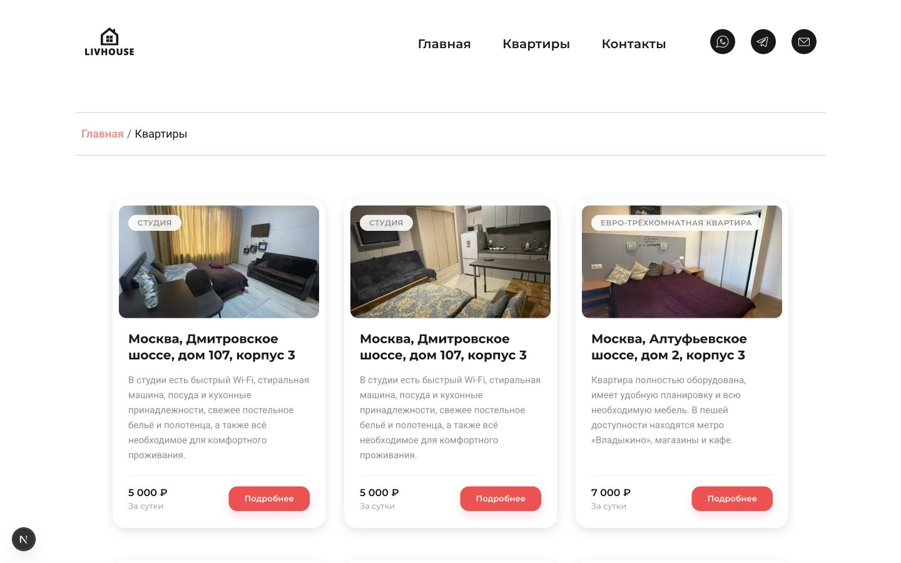
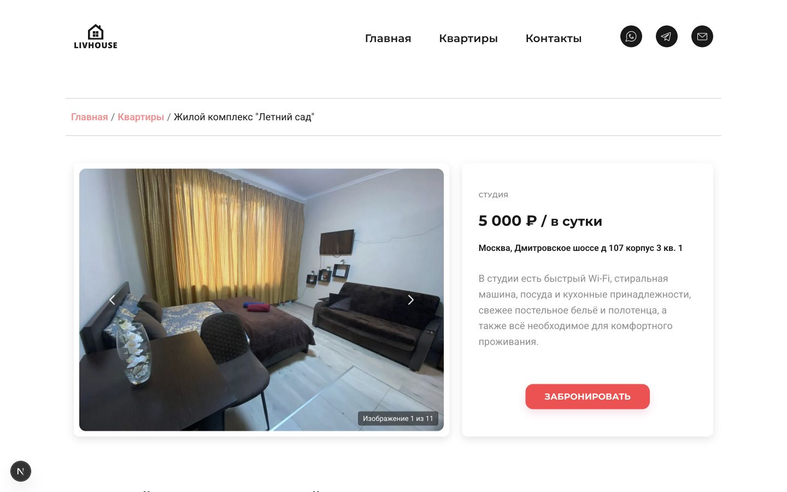
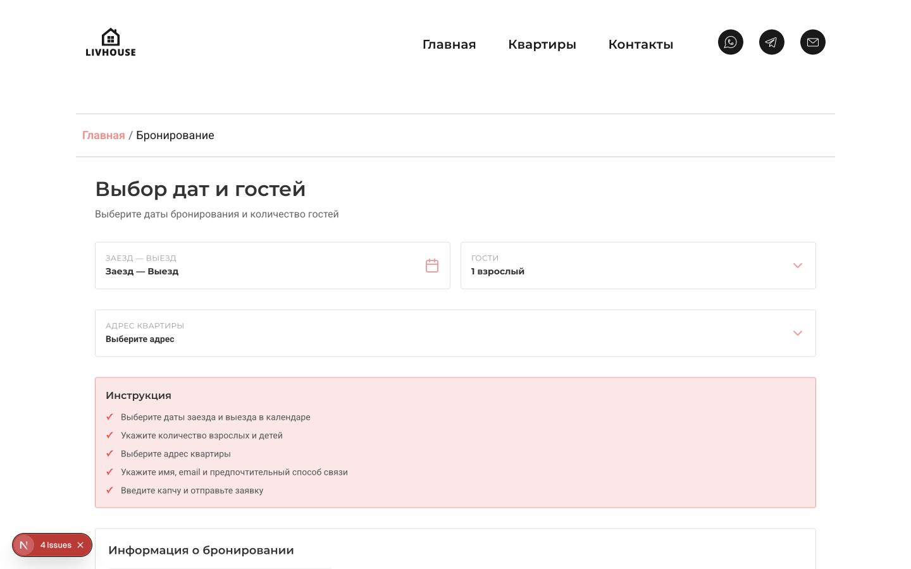

# Moscow Apartments

Moscow Apartments is a bilingual apartment-rental application and full-stack portfolio project built with Next.js and TypeScript. It combines a Russian/English apartment catalog with localized detail pages and a booking form backed by client-side and server-side validation; it is a portfolio/demo application rather than a deployed rental service.

[](https://github.com/Mariam-sudo514/Apartments-in-Moscow/actions/workflows/ci.yml)


## Overview

This project modernizes a legacy apartment-rental frontend as a structured Next.js application. It provides a localized catalog, dynamic apartment pages, responsive galleries, a home carousel, and booking workflows for Russian and English visitors.

The UI is built with React and App Router server components, while booking requests are handled by a Node.js Route Handler with server-side validation, trusted quote calculation, CAPTCHA checks, rate limiting, and configurable email delivery.

## Key Features

- Russian and English localization with locale-aware routes
- Apartment catalog backed by typed static data
- Dynamic apartment detail pages
- Responsive apartment image galleries
- Home apartment carousel with touch, keyboard, and responsive navigation
- Reservation workflow with date, guest, and apartment selection
- Client-side and server-side booking validation
- Trusted server-side quote calculation
- CAPTCHA protection for booking requests
- Configurable email delivery through Mailpit or SMTP
- Responsive navigation with keyboard-accessible mobile behavior
- Localized SEO metadata
- Sitemap and robots endpoints
- Allowlisted redirects from published legacy URLs
- Accessibility improvements across navigation, forms, calendars, and galleries

## Screenshots








## Technology Stack

### Frontend

- Next.js 16.3.0
- React 19.2.8
- TypeScript 6.0.3 with strict checks
- next-intl 4.13.6
- Swiper 12.1.2

### Server

- Next.js Route Handlers
- Nodemailer 9.0.3

### Testing and Quality

- Vitest 3.2.7
- ESLint 9.39.5
- TypeScript strict mode
- GitHub Actions

### Local Infrastructure

- Docker Compose
- Mailpit 1.30.0

## Architecture Highlights

- App Router organizes localized pages and server-rendered route content.
- Typed apartment records provide one source for catalog, detail, carousel, and booking options.
- `next-intl` serves prefixless Russian routes and `/en` English routes.
- The booking Route Handler validates the request again on the server and calculates the trusted quote from typed apartment data.
- Request controls include an 8 KiB body limit, exact-origin and Fetch Metadata checks, CAPTCHA, bounded in-memory rate limiting, and fail-closed configuration checks.
- Nodemailer supports disabled, local Mailpit, and explicitly configured SMTP modes.
- Booking data is not stored in a production database in this public version; it remains in memory during the request and is passed to the configured mail transport.

## Getting Started

The interface can be opened without SMTP or Docker configuration.

```bash
git clone https://github.com/Mariam-sudo514/Apartments-in-Moscow.git
cd Apartments-in-Moscow
npm ci
npm run dev
```

Open `http://localhost:3000`. The project uses Node.js 22.22.0 in CI and Docker; use that version or a compatible newer Node.js 22 release with npm 10 or newer.

## Environment Configuration

The tracked `.env.example` contains placeholders only. Copy it to an ignored local environment file when testing booking delivery, and never commit credentials.

The application uses `NEXT_PUBLIC_SITE_URL`, `BOOKING_ALLOWED_ORIGINS`, `BOOKING_RATE_LIMIT_SECRET`, `BOOKING_TRUST_PROXY`, `BOOKING_RATE_LIMIT_MAX`, and `BOOKING_RATE_LIMIT_WINDOW_MS` for site and request protection. The rate-limit secret is a locally supplied 64-character hexadecimal value.

Set `BOOKING_MAIL_MODE=mailpit` for local delivery and run the Docker Compose stack. Mailpit is available at `http://127.0.0.1:8025`. Explicit SMTP mode additionally requires the server-side `BOOKING_SMTP_HOST`, `BOOKING_SMTP_PORT`, `BOOKING_SMTP_SECURE`, `BOOKING_SMTP_USER`, `BOOKING_SMTP_PASS`, `BOOKING_MAIL_FROM`, and `BOOKING_MAIL_TO` variables. Do not put real values in the repository.

```bash
docker compose --env-file .env.mailpit.local up -d --build
docker compose ps
docker compose down
```

## Available Scripts

| Command | Purpose |
| --- | --- |
| `npm run dev` | Start the development server |
| `npm run build` | Create a production build |
| `npm run lint` | Run ESLint |
| `npm run typecheck` | Check TypeScript types |
| `npm test` | Run automated tests |
| `npm run test:coverage` | Run tests with coverage |
| `npm run verify` | Run the complete quality check |

## Testing and Quality

The automated Vitest suite covers apartment data and manifests, localized date and calendar logic, booking validation, trusted quotes, request security boundaries, CAPTCHA, mail configuration and rendering, redirects, and SEO invariants. Run `npm run test:coverage` for the coverage report and `npm run verify` for the lint, typecheck, test, and production-build checks.

GitHub Actions runs the quality checks, dependency audit, Compose validation, and container build on pushes and pull requests targeting `main`.

## Project Scope and Limitations

Moscow Apartments is a portfolio/demo application with static apartment data. It has no production database and does not implement real payments. Production SMTP credentials are not stored in the repository; local email delivery is tested through Mailpit, while production SMTP requires private environment configuration.

There is no public Live Demo or production deployment in this repository. GitHub Pages is not suitable because the booking API, CAPTCHA, and server-side email delivery require a Node.js runtime. Inventory management, booking persistence, idempotency, and production operations remain outside the public portfolio version.

## Technical Documentation

For implementation details, see [Technical Overview](docs/technical-overview.md).
